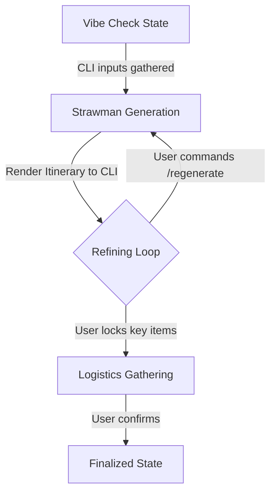

# Product Requirements Document: Kickstart (The Travel Activation Agent)

## 1. Objective & Value Proposition
**Kickstart** is a CLI-based concierge agent designed to solve the "activation energy" problem of travel planning. Many travelers experience a mental block when faced with a blank canvas, leading to analysis paralysis. Kickstart lowers this barrier by replacing open-ended planning with low-friction CLI micro-interactions, "strawman" draft itineraries, and progressive refinement.

---

## 2. Tool & Interface Design

### 2.1 User Interface (CLI)
*   **Design Principle**: Minimal typing, structured feedback.
*   **Interface Type**: Interactive Command Line Interface (CLI) using `questionary` or `inquirer`.
*   **Startup Behavior**: The CLI automatically checks for active/unfinished sessions.
    *   *Prompt*: `> Found an unfinished plan for Tokyo. Would you like to resume? (Y/n)`
*   **Onboarding (Vibe Check)**: Uses interactive CLI menus (e.g., list selection, yes/no questions).
    *   *Example*: `? Choose a vibe: (Use arrow keys) > City Exploration, Nature Retreat, Beach Relaxation`
*   **Itinerary View**: Prints a structured timeline to the console with index numbers.
*   **Command Loop**: A continuous prompt loop supporting:
    *   `/swap [index]` (requests alternative for that slot)
    *   `/lock [index]` (freezes that activity)
    *   `/regenerate` (re-drafts unlocked slots)
    *   `/done` (finalizes itinerary)

### 2.2 Agent Tools & Framework
*   **Framework**: **`google-adk`** (Google Agent Development Kit).
*   **Location Search Tool**: Google Places API (places of interest, hotels).
*   **Weather Checker Tool**: OpenWeatherMap API (forecast verification).
*   **Transit/Routing Tool**: Mapbox Matrix API (travel time estimation).
*   **Mock Booking Tool**: Simulated flight/hotel search tool.

---

## 3. Context & Memory

### 3.1 Short-Term Memory (Session State & Persistence)
*   **Goal**: Maintain and persist the current planning session state across CLI runs (crash recovery).
*   **Implementation**: Managed via `google-adk`'s built-in **`SqliteSessionService`**.
*   **Stored Data**:
    *   Current itinerary draft (JSON).
    *   Rejected options (to avoid repeating suggestions).
    *   Locked options.

### 3.2 Long-Term Memory (User Profile)
*   **Goal**: Personalize future trips based on past interactions.
*   **Implementation**: Custom **`SQLiteMemoryService`** extending `google-adk`'s `BaseMemoryService`.
*   **Stored Data**:
    *   Implicit preferences: Rejections update preference weights (e.g., lower weight for museums if rejected).
    *   Explicit preferences: Home city, dietary restrictions, budget tier.

---

## 4. Orchestration & Logic

### 4.1 Orchestration Flow
The agent uses a structured transition flow managed by `google-adk`:

### 4.2 Robustness & Fallbacks (Error Handling)
*   **API Failures**:
    *   *Places API*: Fallback to generic template items (e.g., "Local park visit") with a CLI warning.
    *   *Weather API*: Skip weather checks (assume fair weather) with a CLI warning.
    *   *Transit API*: Fallback to straight-line distance/speed estimates (e.g., assuming 30km/h average city speed).
*   **LLM Schema Validation**: If the LLM fails to output the required JSON schema, the agent retries (max 3 times). If it still fails, it asks the user to simplify their last request.
*   **Database Failures**: If SQLite is locked or unavailable, fall back to in-memory state for the current session and alert the user that progress cannot be saved.

---

## 5. Scope Boundaries (MVP vs. Future)

### 5.1 In Scope for MVP
*   Single-destination trip planning (up to 3 days).
*   Interactive CLI onboarding and refinement loop.
*   Local SQLite persistence for sessions and long-term memory.
*   Mocked transit and flight tools.
*   CLI-based execution.

### 5.2 Out of Scope
*   Multi-destination complex trips.
*   Actual booking integration.
*   User authentication (assumes single-user local machine).
*   Web/Mobile UI.

---

## 6. Observability & Tracing

### 6.1 Telemetry
*   Uses `google-adk` built-in telemetry.
*   **Execution Mode**: Tracing to Arize Phoenix is disabled by default. It can be enabled by developers using a `--debug` or `--trace` CLI flag to avoid running local servers for standard users.
